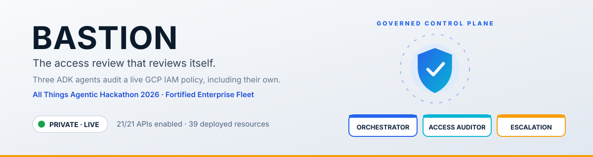

# Bastion

<p align="center">
  <picture>
    <source media="(prefers-color-scheme: dark)" srcset="assets/brand/banner-dark.svg">
    <source media="(prefers-color-scheme: light)" srcset="assets/brand/banner-light.svg">
    
  </picture>
</p>

<p align="center">
  <strong>Three institutional agents. One durable investigation identity. No raw IAM binding crosses the model or human-notification boundary.</strong>
</p>

<p align="center">All Things Agentic Hackathon 2026 · Fortified Enterprise Fleet</p>

[](https://github.com/iarjunganesh/bastion/actions/workflows/ci.yml)
[](https://codecov.io/gh/iarjunganesh/bastion)
[](https://www.python.org/)
[](https://google.github.io/adk-docs/)
[](LICENSE)
[](https://developers.google.com/profile/badges/community/gear?u=iarjunganesh)

## Why Bastion exists

Access review is quarterly work performed on continuously changing permissions. Automating the
scan is not enough: an institutional agent must remember prior human decisions, survive
asynchronous retries, prove why it acted, and remain unable to turn suspicious input into a
privileged write.

Bastion performs read-only IAM review against the GCP project that runs it—including its own
service identities. Deterministic code detects, scores, and routes findings. Gemini explains
already-minimized risk and never decides any part of it. Humans receive counts and allowlisted
categories, never bindings.

## What is live

The committed [GCP measurement](assets/architecture/gcp-state.json) was generated from the live
project and contains counts only:

- 21/21 named Google Cloud APIs enabled and 38 deployed resources measured;
- four Cloud Run services in `europe-north2`;
- a managed Agent Runtime and a separate durable Memory Bank in `europe-west4`;
- one Agent-to-Anywhere Gateway, IAP authorization extension, and fail-closed auth policy;
- a governed Agent Registry catalog containing the Runtime, two A2A workers, and every approved
  Google API egress destination;
- Firestore durable state, Pub/Sub/Eventarc delivery, a five-attempt dead-letter route, and a
  review subscription;
- a regional Model Armor template and two Secret Manager secrets;
- a 365-day regional audit bucket, four log-based metrics, five enabled alert policies, and the
  **Bastion Fleet Operations** dashboard.

Observed production checks include:

- a managed Runtime session traversing the Gateway and returning two streamed events;
- Pub/Sub → Eventarc → Firestore completion with one durable attempt;
- an unauthenticated findings request denied with `403`;
- the real Escalation Agent identity creating one redacted review record, followed by the same
  idempotency key being accepted without creating a duplicate;
- a Vertex quota failure recorded as a payload-free `model.request=failed`, with the
  investigation left reclaimable rather than cleared;
- 251 tests at 100% statement and branch coverage under Python 3.12.

The retained evidence is indexed in [assets/README.md](assets/README.md). The exact distinction
between deployed, observed, and still-to-capture claims lives in
[submission/SUBMISSION.md](submission/SUBMISSION.md).

## The production path

```text
Pub/Sub event
    │
    ▼
Eventarc ──OIDC──▶ Cloud Run durable ingress
    │              inbox · lease · retry · dedup
    │
    └────────────▶ managed Agent Runtime (Agent Identity)
                         │
                         ▼
                Agent-to-Anywhere Gateway
                  IAP · default deny · Registry
                    │                 │
              Access Auditor     Escalation Agent
                    │                 │
          Cloud Asset/IAM       private findings API
                    │                 │
                    └──── minimized ──┘
```

There is no production in-process fallback. The Cloud Run Orchestrator is only the durable
Eventarc admission and dispatch boundary; it invokes the identity-bearing managed Runtime.
The Runtime discovers two worker agents through reviewed Agent Cards and its Gateway-bound
Registry allowlist.

### The fleet

| Agent | Institutional responsibility | Enforced capability |
|---|---|---|
| **Orchestrator** | Own investigation lifecycle, policy, routing, and escalation | Managed Agent Identity; Registry/Gateway egress; Firestore state |
| **Access Auditor** | Read the live policy and produce opaque, deterministic findings | Read-only IAM, Asset Inventory, and Recommender access |
| **Escalation Agent** | Deliver a validated count to the owning department | Findings API invocation; no IAM or Asset read role |

The Cloud Run services expose two security shapes deliberately:

- worker A2A origins are network-reachable because the cross-region managed Gateway is not
  classified as Cloud Run internal traffic; every non-health request still requires a
  Secret-Manager-backed origin credential, while Agent Identity is admitted per destination by
  IAP at the Gateway;
- the findings endpoint is network-reachable but IAM-private. Only
  `escalation-agent-sa` has `roles/run.invoker`; anonymous traffic is rejected by Cloud Run.

## What "scalable network" means here

The track asks for a *scalable network of institutional agents*. Bastion's scaling axis is
deliberately **not** more agents — [ADR-002](docs/adr/002-three-agents.md) fixes the fleet at
three, because a fourth agent with the same data access proves nothing that a third does not.
The network scales on two axes that actually matter in an institution:

| Axis | How it grows | Cost of growth |
|---|---|---|
| **Owning departments** | A row in the catalog with its principal patterns; routing picks it up with no code change | One catalog entry |
| **Catalogued agents** | An Agent Card registered in the managed Registry and an approved Gateway destination | One registration; no orchestrator change |
| **Throughput** | Bounded Cloud Run autoscaling behind durable Eventarc delivery, with leases, retry, and a five-attempt dead letter | Configuration |

The measured proof that the first axis is real rather than decorative is
[evidence 09](assets/evidence/09-cross-department-routing.md): 52 live IAM bindings produced 3
findings that routed to **2 different owning departments**, deterministically and without a
model deciding who owns what.

Instance caps are deliberate. `BASTION_MAX_INSTANCES=3` follows the organizers' own
cost guidance; it is a budget ceiling, not an architectural one.

## How the track requirements are answered

| Track requirement | Bastion evidence |
|---|---|
| Agents cataloged for cross-department use | Versioned Agent Cards publish owner, department, purpose, skill, classification, policy version, approval state, and health metadata. `route_by_department()` turns ownership into an enforced routing decision. |
| Context maintained across weeks of asynchronous work | Stable event/context IDs, Firestore inbox and leases, managed sessions and Memory Bank, expiring human-approved exceptions, retry/dead-letter handling, and idempotent notification keys. Restart and prior-week suppression are integration-tested. |
| Production data without violating compliance, sovereignty, or security policy | Read-only Cloud Asset Inventory. **No raw member, role, resource, or binding ever crosses the model boundary** — only opaque IDs, categories, departments, and bounded scores — so sovereign data is not merely kept in-region, it never leaves the process. Model Armor fails closed, output is screened before notification, logs carry no payload values, identities are separated, and state stays in the EU. |

## Deterministic safety boundary

Bastion does not ask a model to decide whether a permission is safe.

1. The Auditor reads production IAM under a read-only identity.
2. Deterministic rules produce an opaque finding ID, category, department, and bounded score.
3. Those findings cross the A2A boundary as a validated schema, not as prose a model retypes.
4. The threshold and the department catalog are applied by a step that holds no model at all, and
   a gate refuses to escalate anything that step did not score.
5. Missing or invalid risk is rejected; it can never become a quiet clear.
6. A current, human-approved exception may suppress the same opaque finding until expiry.
7. Model Armor screens input — including tool results, not only prompts — and fails closed when
   unavailable.
8. A deterministic post-model screen blocks principal, role, resource, and PII shapes.
9. The receiver accepts only an allowlisted department, categories, deterministic summary, and
   SHA-256 idempotency key.

`AuditPlugin` is registered at every supported Runner seam. It records run, agent, model, and
tool starts/completions/failures plus Model Armor refusals. Records contain event type, outcome,
actor, investigation ID, invocation ID, argument **names**, model name, and exception
**class**—never argument values, prompts, responses, principal IDs, or exception messages.

The two ids answer different questions. `invocation_id` groups one agent run; ADK mints a fresh
one per run, so it stops at the A2A boundary. `investigation_id` is the durable event id, carried
to each worker as request metadata rather than as message content, so no model reads or restates
it — it is what makes a single investigation reconstructable across all three hops. It is
re-validated as a UUID where it is recorded, because it arrives from a peer.

## Durability and failure tolerance

The Eventarc boundary atomically admits an event before work starts. A running event owns a
bounded lease; concurrent duplicates receive `503` so Eventarc retains delivery. A dead worker's
expired lease can be reclaimed. Completed events are acknowledged without rerunning. Failed
events remain retryable. Delivery is capped at five attempts before the separate dead-letter
review subscription receives it.

Human escalation is independently idempotent. The tool derives
`sha256(investigation_id:department)` and the private receiver creates the document exactly once.
The same authorized request returns success with `accepted=false` on replay.

Operational objectives and alert mappings are in [docs/OPERATIONS.md](docs/OPERATIONS.md).

## Data sovereignty

**Sovereign data never reaches the model at all.** Residency keeps regulated data inside a
region; Bastion does something stronger with the part that matters — raw IAM members, roles,
resources, and bindings stop inside the deterministic Auditor tool and are discarded there. What
crosses the model boundary is an opaque HMAC identifier, a risk category, an owning department,
and a bounded score. There is no prompt from which a principal could be recovered, because no
principal was ever in one.

That is why the deterministic pre-pass exists. `find_anomalies()` decides what is a finding;
Gemini only writes the sentence explaining one. A compliance product cannot answer *"why was this
flagged?"* with *"the model thought so"*, and it cannot leak a binding it was never given.

Where the infrastructure runs:

- Cloud Run, Firestore, Pub/Sub, and Eventarc run in `europe-north2`.
- Agent Runtime, Memory Bank, Gateway, Registry, Model Armor, and the retained audit bucket run
  in `europe-west4`.
- Gemini 3.5 Flash uses Vertex AI `global`. **Global is not a regional-residency claim**, and
  Bastion does not make one. The minimisation above is the control; the region is not asked to be.

The field-level inventory, retention, deletion, and processor boundaries are in
[docs/DATA_GOVERNANCE.md](docs/DATA_GOVERNANCE.md).

## Architecture

<p align="center">
  <picture>
    <source media="(prefers-color-scheme: dark)" srcset="assets/architecture/level-1-context-dark.svg">
    <source media="(prefers-color-scheme: light)" srcset="assets/architecture/level-1-context-light.svg">
    
  </picture>
</p>

<p align="center">
  <picture>
    <source media="(prefers-color-scheme: dark)" srcset="assets/architecture/level-2-container-dark.svg">
    <source media="(prefers-color-scheme: light)" srcset="assets/architecture/level-2-container-light.svg">
    
  </picture>
</p>

The diagrams and animated variants are generated from one reviewed source per level. The latest
arrow, status-dot, banner, SVG, and GIF fixes are preserved in this repository. See
[docs/ARCHITECTURE.md](docs/ARCHITECTURE.md) for trust-boundary detail.

## Run locally

Requirements: Python 3.12, Google Cloud CLI, Application Default Credentials, and a project with
the documented APIs and Model Armor template.

```powershell
git clone https://github.com/iarjunganesh/bastion.git
Set-Location bastion

py -3.12 -m venv .venv
.\.venv\Scripts\Activate.ps1
python -m pip install -r requirements-dev.txt

Copy-Item .env.example .env
gcloud auth application-default login
python -m dotenv run -- adk run --in_memory agents/orchestrator `
  "Run one read-only Bastion access-review investigation."
```

`GOOGLE_CLOUD_LOCATION=global` is the model location. It must not be replaced by
`GCP_REGION=europe-north2`; doing so sends Gemini to an unavailable regional endpoint.

## Deploy from Windows 11

The idempotent bootstrap accepts explicit regions and existing Memory/Runtime IDs, creates
missing generated secrets without printing them, provisions identities and durable resources,
builds one image, deploys the fleet, configures Gateway/Registry/Runtime, provisions
observability, verifies the inventory, and runs the production smoke test.

```powershell
.\infrastructure\bootstrap.ps1 `
  -Project 'YOUR_PROJECT_ID' `
  -MemoryAgentEngineId 'YOUR_MEMORY_ENGINE_ID' `
  -RuntimeAgentEngineId 'YOUR_RUNTIME_ENGINE_ID'
```

The prerequisite and least-privilege role list is in
[infrastructure/REQUIRED_GCP_ACCESS.md](infrastructure/REQUIRED_GCP_ACCESS.md).

Useful independent gates:

```powershell
$env:GCP_PROJECT_ID = 'YOUR_PROJECT_ID'
$env:GCP_PROJECT_NUMBER = gcloud projects describe $env:GCP_PROJECT_ID --format='value(projectNumber)'
$env:GCP_REGION = 'europe-north2'
$env:AGENT_RUNTIME_REGION = 'europe-west4'
$env:BASTION_RUNTIME_AGENT_ENGINE_ID = 'YOUR_RUNTIME_ENGINE_ID'

python -m infrastructure.verify_fleet
python -m infrastructure.provision_observability
python -m infrastructure.smoke_test
python -m infrastructure.rollback       # dry-run candidates only
python -m infrastructure.teardown       # dry-run plan only
```

Applying rollback requires an exact service and one of its two newest safe revisions. Applying
teardown additionally requires `--confirm-project`; by design it preserves Firestore, secrets,
Agent Runtime, and retained compliance logs.

## Quality gates

```powershell
ruff check .
ruff format --check .
mypy agents gateway identity registry runtime model_armor observability infrastructure
pytest tests --cov --cov-report=term-missing --cov-fail-under=100
python scripts/check_docs.py
python scripts/check_versions.py
python scripts/render_diagrams.py --check
```

CI holds no GCP **key**, and never will: `infrastructure/provision_wif.sh` federates GitHub
Actions through Workload Identity so a short-lived OIDC token is exchanged for a short-lived
Google one. There is nothing to leak and nothing to rotate. The provider pins
`assertion.repository` to one repository — Google accepts any token GitHub's issuer signs, and
GitHub signs one for every repository on the platform, so that condition is the entire boundary.

The federated identity may deploy **code** and may not change **authority**: `run.developer`
rather than `run.admin`, and no role that can create a binding or alter Eventarc, Pub/Sub, the
Agent Registry, Firestore, Secret Manager, or the audit bucket. It may act as the three workload
identities and not as the approver identity, so a pipeline cannot approve the suppression of a
finding. The Deploy workflow is `workflow_dispatch` only, because deploying a live
access-governance fleet is a decision someone should make rather than a consequence of merging.

GitHub Actions otherwise runs deterministic unit, integration, security, load, type, dependency,
secret, documentation, and diagram gates. The current local Python 3.12 result is **251 passed
and 100.00% coverage**.

## Repository map

```text
agents/                     three ADK agent definitions and managed Runtime entrypoint
gateway/                    local policy contract and Cloud Run origin authentication
identity/                   least-privilege workload manifest
model_armor/                fail-closed input and deterministic output screening
observability/              payload-free ADK audit plugin
registry/                   department routing policy
runtime/                    durable SQLite contract and Firestore production adapter
infrastructure/             bootstrap, deploy, Gateway, Runtime, smoke, rollback, teardown
scripts/                    live-state capture, docs/version gates, diagram renderer
tests/                      unit, integration, security, and load suites
assets/                     brand, architecture, and redacted evidence
docs/                       architecture, governance, operations, and ADRs
submission/                 Devpost copy, checklist, and planning ledger
```

## Evidence and decisions

- [Architecture](docs/ARCHITECTURE.md)
- [Data governance](docs/DATA_GOVERNANCE.md)
- [Operations](docs/OPERATIONS.md)
- [Architecture decisions](docs/adr/README.md)
- [ADR-001 — real IAM](docs/adr/001-real-iam-not-mock-data.md)
- [ADR-002 — three agents](docs/adr/002-three-agents.md)
- [ADR-003 — managed platform](docs/adr/003-pillars-on-geap.md)
- [ADR-004 — global Gemini](docs/adr/004-flash-only-global-endpoint.md)
- [ADR-005 — Google ADK and A2A](docs/adr/005-adk-as-the-agent-framework.md)
- [ADR-006 — observable pillar proof](docs/adr/006-pillar-coverage.md)
- [ADR-007 — tool poisoning](docs/adr/007-tool-poisoning.md)
- [ADR-008 — human approval loop](docs/adr/008-human-approval-loop.md)
- [ADR-009 — Model Armor threshold](docs/adr/009-model-armor-threshold.md)
- [ADR-010 — Policy enforcement gate](docs/adr/010-policy-enforcement-gate.md)
- [ADR-011 — Inbound screening covers tool results](docs/adr/011-inbound-screening-covers-tool-results.md)
- [ADR-012 — Structured findings across A2A](docs/adr/012-structured-findings-across-a2a.md)
- [Evidence index](assets/README.md)
- [Submission readiness](submission/SUBMISSION.md)
- [Audit remediation ledger](submission/planning/08-audit-remediation-plan.md)
- [Captured hackathon brief](submission/DEVPOST.md)

## Trust statement

Bastion is read-only with respect to IAM. It can identify, explain, suppress under a current
human exception, and request review; it cannot modify or revoke a binding. Raw production policy
dumps, credentials, endpoint secrets, and unredacted findings are prohibited from Git and
published evidence. See [SECURITY.md](SECURITY.md).

This is a hackathon submission, not supported production software. Licensed under the
[MIT License](LICENSE).
