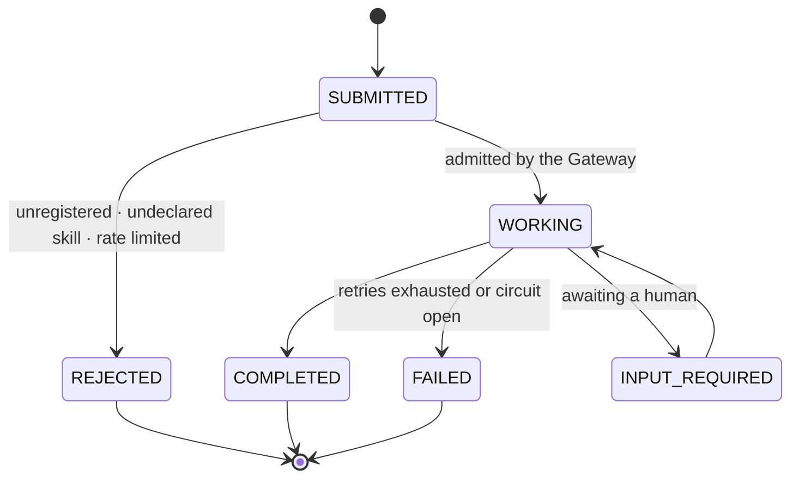

# Bastion — Architecture

Bastion replaces the manual quarterly access review with a fleet of three agents that
audit a live GCP project's IAM policy, remember what a human already approved, escalate
what is genuinely risky, and refuse to be instructed by the tickets they read.

This document describes the system. Decisions that constrain the implementation live in
[`adr/`](adr/README.md). The numbered working notes — judging matrix, build plan, demo
storyboard, release plan — are in
[`submission/planning/`](../submission/planning/07-release-plan.md), and the hackathon's own
requirements are captured verbatim in [`submission/DEVPOST.md`](../submission/DEVPOST.md).

## The audit target is a real IAM policy

Bastion reads the actual IAM policy of the GCP project it is deployed into, via Cloud Asset
Inventory and the IAM API. Not a fixture, not a hand-authored entitlements table.

That policy includes the three service accounts Bastion's own agents run under. So the
system audits its own permissions: when the Access Auditor reports that the Escalation
Agent holds a broader role than its job requires, that is a real finding about a real
system, produced live. The rationale and its trade-offs are recorded in
[ADR-001](adr/001-real-iam-not-mock-data.md).

Findings a normal GCP project actually yields:

- `roles/owner` or `roles/editor` granted where a narrower role would serve
- Service accounts with no recent authentication activity
- Principals holding permissions inherited from a group they no longer belong to
- Bindings carrying neither a condition nor an expiry

## The three agents

| Agent | Responsibility | Scope, enforced by its own service account |
|---|---|---|
| **Orchestrator** | Triggers investigations, routes work, applies the policy rules, owns retry and escalation | Read the registry; write investigation state |
| **Access Auditor** | Reads the live IAM policy and flags anomalies | Read-only on IAM (`roles/iam.securityReviewer`) |
| **Escalation Agent** | Packages high-risk findings for a human | Write-only to the notification surface; **no IAM read access at all** |

Policy enforcement is a function of the Orchestrator rather than a fourth agent
([ADR-002](adr/002-three-agents.md)). Separation of concerns is what the architecture
criterion rewards; agent count is not.

The scope column is the deployment target. The service-account denial contrast is captured, but
the local agents still share one process identity; runtime enforcement and a repeatable security
test are pending ([ADR-006](adr/006-pillar-coverage.md)).

## Grounding against the track requirements

The Fortified Enterprise Fleet brief asks entrants to demonstrate three things and to build
seven components in four named groups. This section maps each clause to where it is
satisfied, and states plainly which ones are not yet proven.

### The three demonstrations

| The brief asks for | Bastion | Proven? |
|---|---|---|
| *"agents cataloged for cross-department use"* | A department is a **routing decision**, not a column: `route_by_department()` fans one investigation out to the teams that own the principals it concerns. GEAP's Agent Registry is the shared catalog those teams read | ✅ **observed** — two findings, two owning departments, [evidence 02](../assets/evidence/02-gemini-investigation.md) |
| *"safely maintain context across weeks of asynchronous operations"* | Eventarc admission stores and deduplicates each investigation in Firestore, then reuses its stable context ID as the managed ADK session/memory identity; approved exceptions carry expiry, reviewer, and policy version | ◐ **deployed and unit-tested.** A retained cross-week replay is the remaining proof artifact |
| *"interact with production data without violating enterprise compliance, data sovereignty, or security policies"* | The audit target is a **live** IAM policy, read through Cloud Asset Inventory and never written back. Raw policy dumps never enter the repository; peer and human-review payloads are schema-limited | ✅ **deployed controls;** retained production evidence is still being captured |

### Data sovereignty, stated honestly

The brief names data sovereignty explicitly, so this project cannot leave it implicit.

Cloud Run, Firestore, and Pub/Sub are pinned to **`europe-north2`** (Stockholm), so
investigation state, findings, and the exception store stay in one EU region.

**Two things leave it, and both are named rather than buried.**

First, **Model Armor screening runs in `europe-west4`**. Model Armor does not serve
`europe-north2` — probing returned *"Location not found"* for both Nordic regions while
`europe-west4` returned a permissions error, which is the shape of a region that exists. So
every prompt that gets screened crosses one EU region boundary before it reaches the model.
It stays inside the EU, which is why this is a footnote rather than a blocker, and it is why
`MODEL_ARMOR_LOCATION` is a **third** setting rather than a reuse of `GCP_REGION`.

Second, **model traffic is not region-pinned at all.** Gemini 3.5 is served only from Vertex
AI's `global` location ([ADR-004](adr/004-flash-only-global-endpoint.md)) — there is no
regional endpoint to choose. Two consequences, both deliberate:

1. What crosses that boundary is minimised by design. Detection is **deterministic** and runs
   before any model call; Gemini is asked to write the rationale for a finding, not to find it.
   The model never receives the raw policy document.
2. A production access-governance system handling third-party principals would need a
   residency guarantee that `global` cannot give. That is a real limitation of this build, not
   an oversight, and it is recorded rather than hidden.

### Least privilege, stated just as honestly

The Access Auditor runs under its own `roles/iam.securityReviewer` service account; the
Escalation Agent holds no policy-read permission and can invoke only the count-only findings
inbox. The Orchestrator reaches both peers over private Cloud Run A2A with audience-bound ID
tokens. A retained deployed `PERMISSION_DENIED` capture remains the evidence artifact for this
boundary; it is not a gap in the configured IAM separation.

## The seven pillars, in the brief's four groups

**Six of the seven are managed Google products, and Bastion consumes them rather than
reimplementing them.** That is [ADR-003](adr/003-pillars-on-geap.md), and it was bought:
`gateway/`, `registry/`, `runtime/`, `memory/`, `model_armor/` and `observability/` were once
hand-rolled here against products that already existed, and ~3,460 lines were deleted on
2026-08-15 when that was noticed. What remains in this repository per pillar is the **seam** —
the one function or callback that points at the managed surface.

Each section below states what is running today, not what is intended. Two pillars have been
observed working; the rest are honest about being enabled and unwired.
[ADR-006](adr/006-pillar-coverage.md) is the per-pillar ledger.

### Discovery & Lifecycle

#### Agent Registry — ✅ three Bastion services catalogued as private A2A peers

The brief calls this *"the central repository for publishing, versioning, and discovering
enterprise-approved agents"*, and GEAP's Agent Registry is that repository: it stores A2A
Agent records and catalogs agents, tools and MCP servers. Bastion registers its three private
Cloud Run services through `agent-registry services create`; the managed registry projects those
services into discoverable Agent records with JSON-RPC interfaces. Registration is idempotent and
uses the canonical regional Cloud Run origin, rather than the old alias that cannot resolve the
private A2A card route.

The measured state is four catalog records: Google's pre-registered Workspace Agent and Bastion's Access
Auditor, Escalation Agent, and Orchestrator. The three Bastion records are the cross-department
catalog surface; their endpoints remain private and require workload identity to invoke.

**Bastion's own use of the catalog is cross-department routing, and that part runs.** The track
asks entrants to show *"how agents are cataloged for cross-department use"*, and a `department`
column nothing branches on does not answer it. So
[`registry/departments.py`](../registry/departments.py) makes a department a **routing
decision**: `resolve_owning_department()` matches a principal against an ordered pattern list,
and `route_by_department()` fans one investigation out to the teams that own the principals it
concerns. Security engineering does not own the data platform's service accounts, and an alert
landing on the wrong desk is an alert that gets ignored.

`load_catalog()` is the seam — one function to repoint at the managed registry once agents
exist in it, rather than a rewrite. The catalog is declared in the module until then, and
`escalation_target` is a team name rather than a URL: an endpoint belongs in Secret Manager, and
a catalog carrying endpoints becomes a thing worth attacking.

Observed: two findings, two different owning departments, in one run
([evidence 02](../assets/evidence/02-gemini-investigation.md)).

### Core Execution & State

#### Agent Runtime — ● private Cloud Run fleet deployed

`adk deploy cloud_run` is the runtime seam, and it is one command rather than a service this
repository writes. Four of the pillars are flags on it: `--trace_to_cloud` (Observability),
`--a2a` (the A2A endpoint the Gateway routes to), `--session_service_uri` and
`--memory_service_uri` (Memory Bank). The long-running half is Vertex AI Agent Engine.

Three agent services and the private findings service are deployed. The Orchestrator retains the
deterministic policy step locally, while capability-bearing peers are reached over authenticated
A2A; the local `SequentialAgent` remains only the development topology.

#### Memory Bank — ◐ managed endpoint configured; cross-week replay pending

`VertexAiMemoryBankService` behind `--memory_service_uri`, with `VertexAiSessionService` for
session state. The product claim is the exception store: an agent that re-raises a finding a
human already accepted every week is a worse experience than the spreadsheet it replaced, and
suppression is what makes a continuous review tolerable to operate rather than merely
continuous.

The run captured in [evidence 02](../assets/evidence/02-gemini-investigation.md) used
`InMemorySessionService`, so nothing persisted and no prior-week exception was recalled. **That
historical run predates the deployed Eventarc/Firestore admission path; a retained prior-week
replay remains the current evidence gap. The
memory-suppression demonstration is unproven**, and it is one of the three the submission
rests on ([`submission/SUBMISSION.md`](../submission/SUBMISSION.md)).

### Security & Governance

#### Agent Identity — ● per-service IAM boundary deployed

The design is one service account per agent, holding exactly the roles its row above allows —
zero trust in miniature, and the one pillar whose *failure* is directly observable, because a
mis-scoped call returns a denial that can be captured on camera. The Escalation Agent holding
no IAM read permission at all is the demonstration: a fully compromised prompt still cannot
make it read the policy.

The three agents run under separate Cloud Run service accounts, with internal ingress and only
the required peer `run.invoker` grant. The security suite tests token audience, policy shape,
and failure-closed configuration; a retained live denial is the remaining demonstration frame.

GEAP's Agent Identity product is a credential broker for *external* auth providers
(`RetrieveCredentials` / `FinalizeCredentials`); it is not the GCP IAM boundary, so the IAM
boundary stays service accounts and roles, as [ADR-003](adr/003-pillars-on-geap.md) scoped it.

#### Agent Gateway — ○ API enabled, no gateway provisioned

`gcloud network-services agent-gateways` is the product, and it is what every agent-to-agent
call is meant to cross ([ADR-003](adr/003-pillars-on-geap.md)). It delegates sanitization to
Model Armor and authorizes on Agent Identity with mTLS and DPoP, and it is consumption-billed —
roughly 750,000 calls a month inside the free tier, which is why routing everything through it
costs nothing this project has.

The hand-rolled gateway that used to be described here — admission checks, a rate limiter, an
A2A task store — was deleted. The typed **A2A task** it carried is still the contract
([ADR-005](adr/005-adk-as-the-agent-framework.md)), and `a2a-sdk` ships `AgentCard`, `Task`,
`TaskState` and `TaskStatus` so nothing needs redefining. `REJECTED` remaining distinct from
`FAILED` is the part worth keeping: a policy refusal is the guardrail working, and collapsing
the two makes every guardrail decision invisible in the one place it most needs to be visible.

Gateway retry policy and Orchestrator recovery behavior are not implemented. Their ownership
must be settled against the managed runtime before the failure-tolerance milestone.

#### Model Armor — ● running, and observed blocking

The template `bastion-guardrail` exists in `europe-west4`, and
[`model_armor/guardrails.py`](../model_armor/guardrails.py) calls it from ADK's
`before_model_callback`, which is the seam that can **short-circuit the model call** by
returning an `LlmResponse`. That is the whole implementation: no proxy, no wrapper, one
callback returning a refusal instead of `None`.

**It fails closed.** An unset project or template returns a refusal rather than skipping the
screen, and a screening exception is caught and turned into a refusal — because a guardrail
that becomes a no-op when its dependency is unavailable is an open door with a comment above
it. Observed blocking a prompt-injection payload in
[evidence 01](../assets/evidence/01-model-armor-block.md).

The three threats the brief names, and where each is actually stopped:

| Threat | Where it enters Bastion | Screen |
|---|---|---|
| **Prompt injection** | A ticket description instructing the agent to ignore its rules and approve the access | ● `sanitize_user_prompt` on `before_model_callback`, observed refusing the payload |
| **Tool poisoning** | A tool's *own metadata* — description or parameter schema — crafted so a model reading it calls something it should not. Not primarily an input-text problem, so screening more text does not answer it | ● **Not Model Armor.** A fixed per-agent tool allowlist, repository-owned descriptions, and the IAM boundary underneath ([ADR-007](adr/007-tool-poisoning.md)) |
| **PII leakage** | A model response carrying principal identifiers into the notification surface or the findings store | ● `screen_after_model` on `after_model_callback`; deterministic protected-data detection replaces the response before state or delivery. The count-only findings API independently validates its schema and allowlisted summary. |

**The middle row was measured, not assumed.** The same payload put through Model Armor twice
returned `True` for the prompt-injection shape and `False` for a poisoned tool description — so
the allowlist and the prompt screen are non-redundant controls rather than belt and braces, and
[ADR-007](adr/007-tool-poisoning.md) survives contact with the product.

The outbound control is deliberately separate from Model Armor: Model Armor is the managed,
fail-closed input screen; the local output callback has no raw IAM binding available to it and
blocks protected-data shapes before the strict count-only receiver validates the payload.

### Telemetry

#### Agent Observability — ◐ deployed no-content telemetry; retained trace pending

The brief asks for two distinct artifacts, and they are not the same thing:

- **Audit logs — ● registered.** [`observability/audit.py`](../observability/audit.py) is loaded
  by each server and emits payload-free structured JSON to Cloud Logging.
- **End-to-end reasoning chain traces — ◐ configured.** ADK exports no-content OpenTelemetry
  telemetry; a retained successful multi-agent trace is not yet claimed because Vertex quota
  throttling interrupted the current live capture.

**They are deliberately not derived from one another.** A trace is sampled and expires; a
compliance record is neither. Deriving the audit trail from traces would mean a sampled-out
investigation has no record that it happened.

The plugin is designed to record refusals and failures without payload values, but this behavior
is not yet proven end to end. Registration, correlation, refusal-path tests, and a captured
production record are required before the audit-trail claim is earned.

For a compliance product this is not instrumentation around the product — it **is** the
product, because an access decision nobody can reconstruct is an access decision nobody can
defend at audit.

## Data flow

Two levels, after the C4 convention: what Bastion talks to, then what is inside it. They are
separate pictures because one diagram carrying both was unreadable, and because a judge and a
reviewer want different ones.

**Every box carries its real build state**, and the states are not typed by hand — they are
derived from [`assets/architecture/gcp-state.json`](../assets/architecture/gcp-state.json),
which `scripts/capture_gcp_state.py` writes by querying the live project. As of the latest
capture: **21 of 21 services enabled, 20 resources existing** — four internal Cloud Run
services, Eventarc, Firestore, the investigation Pub/Sub topic, Agent Engine state, Model Armor,
and scoped service identities. Cloud Scheduler and Agent Gateway remain intentionally absent.

That count deliberately **excludes the service accounts Google creates for a project**.
Counting them made the number read as two on a day when Bastion had built nothing, which was
one row away from lifting the gate that rejects fictional architecture images — a measurement
designed to prevent an overclaim, quietly producing one.

| Marker | Means |
|---|---|
| `●` | Built, deployed, and observed working |
| `◐` | API enabled on the project, nothing wired to it yet |
| `○` | Not started |

### Level 1 — Context

  <picture>
    <source media="(prefers-color-scheme: dark)" srcset="../assets/architecture/level-1-context-dark.svg">
    <source media="(prefers-color-scheme: light)" srcset="../assets/architecture/level-1-context-light.svg">
    
  </picture>

The dotted edge is the whole idea: the policy Bastion reads contains the service accounts
Bastion runs under, so the system audits its own permissions.

### Level 2 — Container

  <picture>
    <source media="(prefers-color-scheme: dark)" srcset="../assets/architecture/level-2-container-dark.svg">
    <source media="(prefers-color-scheme: light)" srcset="../assets/architecture/level-2-container-light.svg">
    
  </picture>

Three things in that picture are the argument, and two of them ran.

The **catalog feeds the Orchestrator**, so a department is consulted on every routing decision
rather than stored as a column — one investigation fans out to the teams that own the
principals. The **guardrail sits between the fleet and the model**, not beside it: `seq → armor
→ gemini` is the real call order, and a blocked prompt never reaches the third box. And the
**audit edge is dotted** because the plugin is a side effect of every event rather than a step
in the path, which is precisely why no agent has a logging call site.

The dashed grey box is the evidence gap, not an absent endpoint: managed session/memory is
configured, while a retained cross-week replay is required before suppression is claimed on
camera.

### Level 3 — One task's lifecycle

The audit trail is a record per transition, so the state machine is the shape of the evidence
([ADR-005](adr/005-adk-as-the-agent-framework.md)).

`REJECTED` is deliberately not a kind of `FAILED`. A refusal is the guardrail working, and
collapsing the two would make every policy decision invisible in the one place it most needs to
be visible.

**This state machine is designed, not running.** These are `a2a-sdk`'s own `TaskState` values,
which Agent Gateway enforces once agents are deployed behind it; today the three agents run in
one process and no task transitions through them. `INPUT_REQUIRED` has an obvious consumer in
the escalate-to-human path and no producer at all.

The remaining services — Recommender, Secret Manager, BigQuery, Looker Studio, Firebase
Hosting, Cloud Build, Artifact Registry, Trace, Monitoring, Agent Identity, and Cloud Run
itself — are enabled and listed with their jobs in [ADR-003](adr/003-pillars-on-geap.md). They
are deliberately **not** drawn: a box per enabled API produced a picture nobody could read, and
most are not wired in yet, so drawing them would assert a system that does not exist.

**On the diagram files themselves.** Levels 1 and 2 are hand-authored SVGs at 1920×1080, so a
frame drops into a demo scene without letterboxing; Level 3 is inline mermaid because a state
machine needs no layout decisions. Each SVG is emitted in a light and a dark variant from one
master by `scripts/render_diagrams.py`, and paired here in a `<picture>` element — an SVG
loaded through an `` tag does **not** inherit the page's colour scheme, so the master's
own `prefers-color-scheme` block would leave a light-mode reader looking at the dark palette.
That was measured, not assumed.

Every committed SVG states its build state **in its own text**, and `scripts/check_docs.py`
fails the build if one does not. A caption can be cropped out of a screenshot or dropped by a
Devpost paste; the disclosure has to survive the picture travelling on its own.

Cloud Scheduler is what makes *continuous* literal rather than asserted, and the Recommender
call is what keeps *"this role is too broad"* from being the model's unaided opinion.

## Stack

- **Model:** `gemini-3.5-flash` via Vertex AI on every call, with no Pro tier — 3.5 Pro is
  not available to this project ([ADR-004](adr/004-flash-only-global-endpoint.md))
- **Model location:** `global`. Gemini 3.5 has no regional endpoint; this is separate from
  the infrastructure region and setting the two to the same value 404s every call
- **Framework:** Google ADK — one of the four the rules permit, chosen in
  [ADR-005](adr/005-adk-as-the-agent-framework.md). Pinned and verified importable; the three
  agents are three ADK `LlmAgent`s composed by a `SequentialAgent`
- **Infrastructure:** Cloud Run (compute), Firestore (state and memory), Pub/Sub (async),
  all in `europe-north2` (Stockholm)

**Twenty-one Google Cloud services**, each with a stated job and a pre-agreed cut order, are
enumerated in [ADR-003](adr/003-pillars-on-geap.md): the four above plus Cloud Scheduler,
Recommender, Cloud Asset Inventory, IAM, Model Armor, Secret Manager, Cloud Trace, Cloud
Logging, Cloud Monitoring, BigQuery, Looker Studio, Firebase Hosting, and Cloud Build with
Artifact Registry, and Eventarc. All twenty-one are enabled on the project; the measurement in
`gcp-state.json` says 21 of 21.

The rules require *"at least one Google Cloud infrastructure service."* One is the floor. The
additions are not there for the count — service count is not a judging criterion, and a
bolted-on service damages the architecture score rather than helping it. Each survived the
question *what breaks if we remove it*, and ADR-003 records the answer per service.

## Failure tolerance

The rules ask whether inter-agent routing recovers when a worker loops or hallucinates. The
deployment path has a durable Eventarc inbox, failed-event reclaim, deterministic notification
idempotency, and ADK trigger concurrency/retry controls. They still need a managed-session
endpoint, remote-transport failure injection, and captured operational evidence. Until then,
failure tolerance is not a production claim.

## Deliberately out of scope

Named here so they do not creep in later: enterprise SSO integration, a general policy
language (a handful of explicit rules proves the pattern), multi-tenancy, production-grade
Model Armor tuning, and a dedicated always-on vector database.

## Cost posture

Flash by default. `min-instances=0` and an explicit `max-instances` on every Cloud Run
service. A budget alert set before the first deploy. Authenticated endpoints, because an
open Cloud Run URL is both a security hole and a way to burn credits on bot traffic.

The services stay up through the Sept 1 – Oct 1 judging window rather than being torn down
after recording. A hosted URL is a submission field the rules call *"highly encouraged"*, and
an idle scale-to-zero service costs nothing — teardown would forfeit a field to save nothing.
The recording remains the primary proof, since judges are not obliged to run anything.
