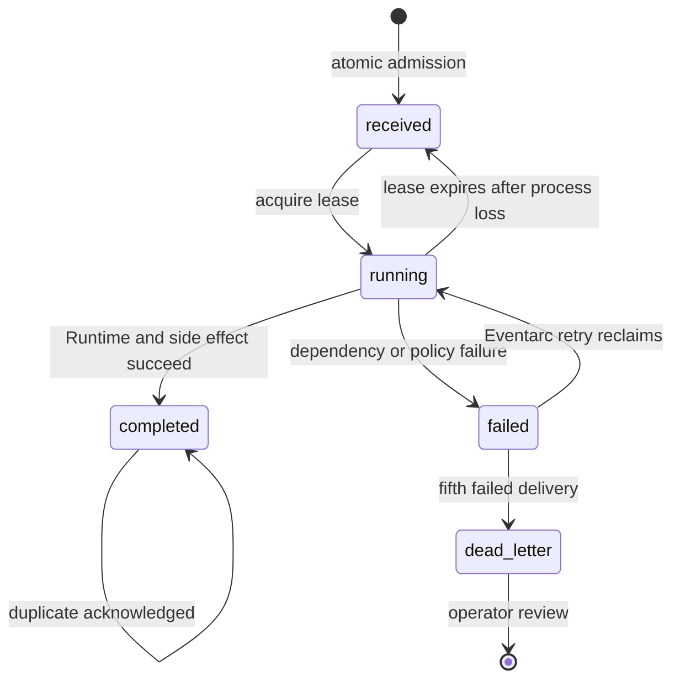

# Bastion architecture

Bastion is a governed institutional-agent fleet for continuous GCP IAM review. It separates
durable delivery, agent reasoning, production reads, and human-review writes so no single model
or workload can silently widen access.

## System context

<p align="center">
  <picture>
    <source media="(prefers-color-scheme: dark)" srcset="../assets/architecture/level-1-context-dark.svg">
    <source media="(prefers-color-scheme: light)" srcset="../assets/architecture/level-1-context-light.svg">
    
  </picture>
</p>

## Production containers and trust boundaries

<p align="center">
  <picture>
    <source media="(prefers-color-scheme: dark)" srcset="../assets/architecture/level-2-container-dark.svg">
    <source media="(prefers-color-scheme: light)" srcset="../assets/architecture/level-2-container-light.svg">
    
  </picture>
</p>

```text
Pub/Sub bastion-investigations
  -> Eventarc + dedicated OIDC delivery identity
  -> private Cloud Run durable ingress
       Firestore admission / lease / attempts / terminal state
  -> identity-bearing Agent Runtime Orchestrator
  -> Agent-to-Anywhere Gateway + default-deny IAP + Registry allowlist
       -> Access Auditor A2A worker -> read-only IAM / Asset / Recommender
       -> Escalation A2A worker -> IAM-private findings API
  -> Cloud Logging audit sink -> 365-day europe-west4 analytics bucket
```

The production dispatcher has no local graph fallback. It does not hold the A2A origin secret,
cannot invoke worker services directly, and has no Model Armor or Pub/Sub publisher role. Its one
agent action is invoking the managed Runtime identified in deployment configuration.

## Agent responsibilities

### Orchestrator

The Orchestrator is deployed to managed Agent Runtime with an Agent Identity. A deterministic
sequential workflow owns policy validation and transfers already-minimized state between the two
workers. It can use only destinations catalogued in Agent Registry and admitted by Gateway IAP.

The sequence is `access_auditor -> policy_step -> policy_gate -> escalation_agent`. Two of those
four steps hold no model. `policy_step` applies the risk threshold and the department catalog by
calling them directly, so a language model never sits between the Auditor's deterministic output
and the deterministic decision made from it — it cannot skip the threshold, and it cannot retype
a finding's opaque id, category, or score on the way past
([ADR-010](adr/010-policy-enforcement-gate.md),
[ADR-012](adr/012-structured-findings-across-a2a.md)). `policy_gate` then refuses to continue
unless `policy_step` left its own result in session state, so an investigation that failed to
score its findings fails visibly instead of escalating them un-evaluated.

The gate lives here rather than inside the Escalation Agent because the Escalation Agent is
remote. A guard that travels over A2A is a guard the caller must trust the callee to run, which
is not a trust boundary this design has anywhere else.

### Access Auditor

The Auditor reads the live project policy under read-only roles. Deterministic code—not Gemini—
classifies broad roles, derives an HMAC-backed opaque finding ID, chooses the owning department,
and computes a bounded risk score. Raw members, roles, resources, and bindings remain inside this
tool boundary.

### Escalation Agent

The Escalation Agent sees only opaque identifiers, categories, score, and department. Its sole
side-effect tool accepts a fixed schema and sends count-only human-review records to a Bastion-
owned findings API. It has no IAM or Asset read capability.

## Catalog and cross-department reuse

The regional Agent Registry contains three Bastion agent entries: the managed Orchestrator and
two worker Agent Cards. Each worker card declares owner, department, purpose, version, protocol,
skill, input/output classification, policy version, approval status, and health contract.
`registry/departments.py` maps a department to its approved escalation route and rejects unknown
departments. The same Registry also catalogs approved Google API destinations used by the Runtime.

Catalog metadata is not authority by itself. Gateway IAP authorizes the Runtime Agent Identity on
each Registry resource, and the worker verifies a separately managed origin credential before
processing an A2A request.

## Durable asynchronous lifecycle

Every trigger carries a stable UUID event ID, schema version, source, creation time, context key,
and mock/production marker. Firestore atomically transitions the record:

```text
absent -> received -> running(lease, attempt) -> completed
                         |                      ^
                         +-> failed ------------+
                         +-> expired lease / retry
```

- duplicate admission returns the existing state;
- a concurrent active lease receives `503`, preserving Eventarc delivery;
- an expired lease is reclaimable after a crashed worker;
- a failed dependency records the exception class and remains retryable;
- a completed replay is acknowledged without repeating work;
- Eventarc delivers at most five attempts before the dead-letter review subscription.

Notification is independently idempotent with
`sha256(investigation_id:department)`. The findings API creates a Firestore record once and
returns `accepted=false` for an authorized replay.



## Context across weeks

Managed sessions and Memory Bank preserve conversational context outside process memory.
Firestore preserves the operational state required for replay and crash recovery. A human-
approved exception is keyed by opaque finding ID and has an explicit `approved_until` expiry;
the deterministic policy suppresses the same finding while the exception is current and restores
it after expiry. Integration tests exercise restart recovery and prior-week suppression without
claiming that a wall-clock week elapsed during the test.

## Model and data boundary

1. Read production IAM under the Auditor identity.
2. Apply deterministic classification, routing, scoring, and HMAC pseudonymisation.
3. Consult only a current human-approved exception.
4. Run fail-closed Model Armor screening before each model call.
5. Send minimized structured state to Gemini 3.5 Flash at Vertex AI `global`.
6. Reject any output that resembles a principal, role, resource, secret, or protected-data shape.
7. Validate the fixed notification schema and deterministic summary at the receiver.

Missing or malformed risk never becomes a clear result. Models cannot create exceptions, select a
destination URL, change a policy version, modify IAM, or acknowledge a durable event.

## Observability

`AuditPlugin` is registered by the managed Runtime and worker runners. It emits payload-free
events for run, agent, model, and tool start/completion/failure plus explicit Model Armor refusal
reasons. Correlation uses invocation and event IDs. Argument names and exception classes are
allowed; values, prompts, responses, principal IDs, and exception messages are not.

The live project routes matching events to a 365-day `europe-west4` analytics bucket and has four
log-based metrics, five alert policies, and one operations dashboard. The bucket is retained but
not locked; immutability is not claimed.

## Regions and sovereignty

| Plane | Region |
|---|---|
| Cloud Run, Firestore, Pub/Sub, Eventarc | `europe-north2` |
| Agent Runtime, Memory Bank, Gateway, Registry, Model Armor, audit bucket | `europe-west4` |
| Gemini 3.5 Flash | Vertex AI `global` |

Because model inference uses `global`, Bastion does not claim end-to-end EU residency. It claims
regional workload/state placement and a field-level minimisation boundary before global model
processing. See [DATA_GOVERNANCE.md](DATA_GOVERNANCE.md).

## Deployment and recovery

One Python 3.12 image is built and deployed to four Cloud Run services with distinct commands,
identities, secrets, and ingress. Managed Runtime source is deployed separately with Python 3.12,
Agent Identity, Gateway binding, pinned dependencies, and the full required source package set.

`bootstrap.ps1` provisions and reconciles the fleet from Windows 11. `verify_fleet.py` fails on
wrong ingress, missing identity, missing peer credential, a dispatcher peer credential, missing
Runtime target, absent Eventarc/DLQ, incomplete Registry, or invalid Gateway policy. `smoke_test.py`
adds live Runtime, findings IAM/idempotency, and asynchronous completion checks. Rollback and
teardown are dry-run-first and constrain their targets.

## Current proof boundary

The repository includes redacted proof of Model Armor refusal, a live Gemini investigation,
least-privilege denial, private fleet inventory, managed Gateway/Runtime traversal, findings
IAM/idempotency, and retained observability. The count-only machine capture is
[gcp-state.json](../assets/architecture/gcp-state.json); the evidence index is
[assets/README.md](../assets/README.md).

This architecture does not claim automated IAM remediation, immutable audit storage, legal
compliance certification, end-to-end EU model residency, or historical SLO attainment.
